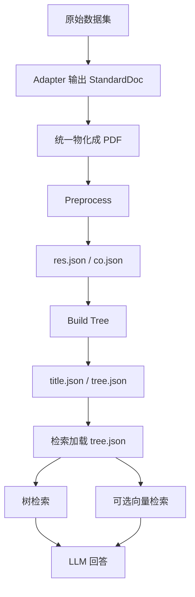

# MoDora 原理与当前实验版本说明

## 1. 核心思想

MoDora 不是把文档简单切成 chunk 后检索，而是：

> 先把 PDF 解析成一棵“文档树”，再沿着树找相关节点，最后让 LLM 基于命中的节点回答问题。

现在做了的工作：

- adapter 统一整理不同数据集；
- 非 PDF 文档先物化成 PDF；
- MoDora 对 PDF 建树；
- QA 阶段使用树检索、可选向量检索和 LLM 回答；
- 根据模型能力切换运行模式：非 VLM 文本模型走 text-only，VLM 多模态模型走完整视觉功能。

## 2. 当前实验流程



## 3. 为什么要统一转 PDF

原版 MoDora 基本面向 PDF，而我们的数据集来源不统一：

| 输入类型 | 当前处理方式 |
|---|---|
| PDF | 直接复制或复用 |
| Markdown / TXT | 转成文本 PDF |
| DOCX | 先转 Markdown，再转 PDF |
| 其他格式 | 报错，不静默跳过 |

物化后的 PDF 放在：

```text
Data/<dataset>/modora/docs
```

同时生成 `_materialized_manifest.json`，记录“原文件 -> 物化 PDF”的对应关系。

## 4. 入库阶段生成的文件

每个 PDF 入库后通常生成：

```text
Data/<dataset>/modora/cache/<pdf_stem>/
  - res.json
  - co.json
  - title.json
  - tree.json
```

| 文件 | 什么时候生成 | 作用 |
|---|---|---|
| `res.json` | preprocess 第一阶段 | PDF 解析后的原始块 |
| `co.json` | preprocess 第二阶段 | 从原始块整理出的文档组件 |
| `title.json` | build-tree 阶段 | 标题层级摘要，主要用于调试 |
| `tree.json` | build-tree 阶段 | 最终文档树，检索阶段真正使用 |

### `res.json`

`res.json` 是 PDF 解析后的底层结果，包含页码、位置、类型和文本内容：

```text
page_id / bbox / label / content
```

如果是 `ocr_model: ppstructure`，它来自 Paddle OCR。  
如果是 `ocr_model: pdf_text`，它来自 PDF 文本层提取，不是真正跑 OCR。

### `co.json`

`co.json` 是从 `res.json` 整理出的 `ComponentPack`：

```text
body: 正文、标题文本、图片、表格、图表等主体内容
supplement: 页眉、页脚、页码、aside 等补充内容
```

注意：标题不是 `co.json` 的单独顶层字段，而是 `body` 里 text component 的属性：

```text
Component(type="text", title="Introduction", title_level=1, data="...")
```

### `title.json`

`title.json` 是标题层级摘要，主要方便人检查：

```text
title / title_level / leveled_title
```

它不是检索阶段主要加载的文件。

### `tree.json`

`tree.json` 是最终文档树，结构类似：

```text
root
  -> 一级标题
      -> 二级标题
          -> 正文 / 表格 / 图片
```

QA 检索阶段真正加载的是所有 `tree.json`。

## 5. 检索阶段到底用哪个文件

检索阶段主要使用：

```text
tree.json
```

不直接使用：

```text
title.json
```

关系是：

```text
build-tree:
  co.json -> title.json
          -> tree.json

retrieval:
  tree.json -> CCTree -> QAService
```

`title.json` 只是调试用摘要；标题层级已经被写进 `tree.json` 的树结构里。  
所以 `tree.json` 已经生成后，删除 `title.json` 通常不会影响检索。

## 6. MoDora 怎么检索

MoDora 的核心是树检索：

```text
query
  -> 从 root 开始
  -> 判断哪些节点相关
  -> 选择值得继续看的子节点
  -> 收集命中节点
  -> LLM 根据 evidence 回答
```

可以这样理解：

> 普通 RAG 是从一堆 chunk 里直接找；MoDora 是先把文档组织成目录树，再沿着目录树找。

优点是能利用文档结构。缺点是如果上层节点判断错，可能漏掉深层答案。

## 7. 向量检索怎么配合

当前实验开启了可选向量检索：

```yaml
enable_vector_search: true
```

它不是替代树检索，而是补召回：

```text
遍历 tree.json 节点
  -> 节点文本做 embedding
  -> 写入 Chroma
  -> 查询时用 query embedding 找相似节点
  -> 与树检索结果合并
```

向量库位置：

```text
Data/<dataset>/modora/store_index
```

embedding 当前是懒加载：不是入库时生成，而是第一次检索时发现缺失后再生成。

## 8. 两种模型能力对应两种运行模式

当前版本不是严格 text-only，而是按模型能力选择不同 MoDora 路径：

```text
非 VLM 文本模型 -> text-only 模式
VLM 多模态模型 -> 完整多模态模式
```

这样做的目的不是削弱 MoDora，而是让同一套实验框架既能跑普通文本模型，也能跑完整 VLM 版本。

### 8.1 非 VLM 文本模型：text-only 模式

当使用普通文本 LLM 时，推荐配置：

```yaml
ocr_model: pdf_text
text_only_mode: true
visual_level_generation: false
visual_relevance_check: false
visual_reasoning: false
enrich_non_text_components: false
```

含义是：

- 不跑 Paddle OCR，直接提取 PDF 文本层；
- 不把截图传给模型；
- 不要求模型具备视觉输入能力；
- 图片、表格、图表不做 VLM enrichment；
- 更适合普通文本 LLM 和批量评测。

优点：快、依赖少、实验稳定。  
缺点：扫描版 PDF 或强视觉信息场景效果可能下降。

### 8.2 VLM 多模态模型：完整模式

当使用 VLM 多模态模型时，可以开启完整 MoDora 功能：

```yaml
text_only_mode: false
visual_level_generation: true
visual_relevance_check: true
visual_reasoning: true
enrich_non_text_components: true
```

这时 VLM 会参与：

| 阶段 | VLM 作用 |
|---|---|
| 非文本组件 enrichment | 给图片、表格、图表生成标题、metadata、描述 |
| 标题层级识别 | 根据字号、位置、视觉层次判断标题级别 |
| 节点相关性判断 | 用节点截图辅助判断是否相关 |
| 最终回答 | 把命中页面截图和文本证据一起给模型推理 |

简单说：

```text
text-only = 更轻量，适合文本模型
VLM 模式 = 更接近原版，适合复杂版面和视觉信息
```

所以我们的策略是：

> 非 VLM 模型不强行走视觉流程，避免图片输入导致异常；VLM 模型则保留 MoDora 原本的完整多模态能力。

## 9. 原版与当前版本对比

| 对比项 | 原版 MoDora | 当前实验版本 |
|---|---|---|
| 定位 | 多模态文档理解应用 | 批量评测后端 store |
| 输入 | 主要 PDF | 多数据集统一物化成 PDF |
| OCR | 偏 Paddle/PP-Structure | 可按实验选择 `ppstructure` 或 `pdf_text` |
| 模型 | 更偏 VLM | 同时支持文本 LLM 和 VLM |
| 检索 | LLM 引导树检索 | 树检索 + 可选向量补召回 |
| 向量库 | 不是主流程 | Chroma 存树节点 embedding |
| rerank | 不是当前重点 | 支持但默认关闭 |
| 删除 | 应用自身逻辑 | 支持清 cache/docs/store_index |

当前版本没有把 MoDora 改成普通 RAG，也不是只能 text-only。它保留“文档树检索”思想，同时增加了模型能力适配：

```text
文本模型 -> text-only 降级路径
VLM 模型 -> 完整多模态路径
```

## 10. 删除逻辑

当前配置：

```yaml
delete_mode: cache_only
delete_vector_index: true
```

含义：

- `delete_mode: cache_only`：删除 MoDora cache，保留物化 PDF；
- `delete_vector_index: true`：同步删除 Chroma 向量库 `store_index`。

如果要连 PDF 一起删：

```yaml
delete_mode: docs_and_cache
```

如果只想清向量库：

```yaml
delete_mode: none
delete_vector_index: true
```

## 11. VersionRAG 实验 0038-0041 观察

我们在 VersionRAG 上做了四组消融实验，对比两个因素：

```text
OCR 开 / 关
embedding 开 / 关
```

所有实验都评测 100 条问题。

| 实验 | 配置 | 平均检索耗时 | 平均 F1 | Accuracy |
|---|---|---:|---:|---:|
| `0038` | OCR 关 + embedding 开 | 123.12s | 0.393 | **0.780** |
| `0039` | OCR 关 + embedding 关 | 114.51s | 0.309 | 0.655 |
| `0040` | OCR 开 + embedding 关 | **96.55s** | 0.306 | 0.600 |
| `0041` | OCR 开 + embedding 开 | 111.02s | **0.424** | 0.745 |

主要观察：

- embedding 对效果有明显帮助。无 OCR 时 Accuracy 从 `0.655` 提升到 `0.780`；有 OCR 时 Accuracy 从 `0.600` 提升到 `0.745`。
- OCR 在这批 VersionRAG 文档上不一定带来更好效果。`OCR 关 + embedding 开` 的 Accuracy 最高，说明直接使用 PDF 文本层可能更保留当前任务需要的文本结构。
- OCR 开启后上下文更短、速度更快，例如 `0040` 平均检索耗时最低，但效果也最低，说明“更短上下文”不等于“更好答案”。
- `0041` 的 F1 最高，但 Accuracy 低于 `0038`，且包含首次补 embedding 索引成本。

因此当前更推荐作为主配置的是：

```text
OCR 关 + embedding 开
```

对应实验：

```text
experiment_0038
```

这组配置在 Accuracy、F1 和运行稳定性之间比较均衡，也符合我们当前对非 VLM 文本模型的适配思路。
